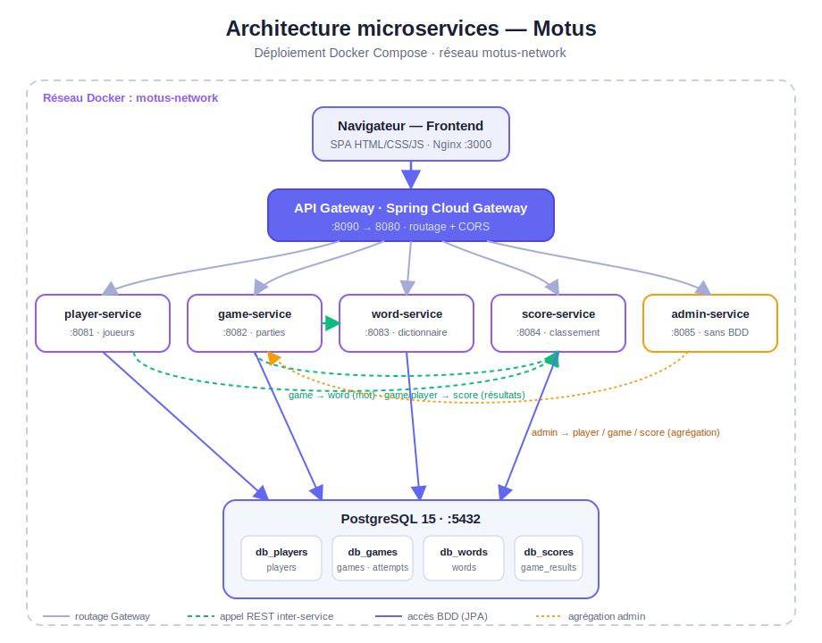
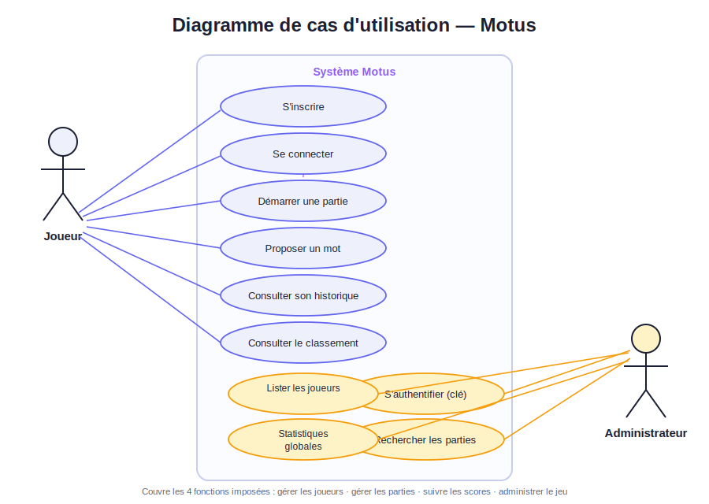
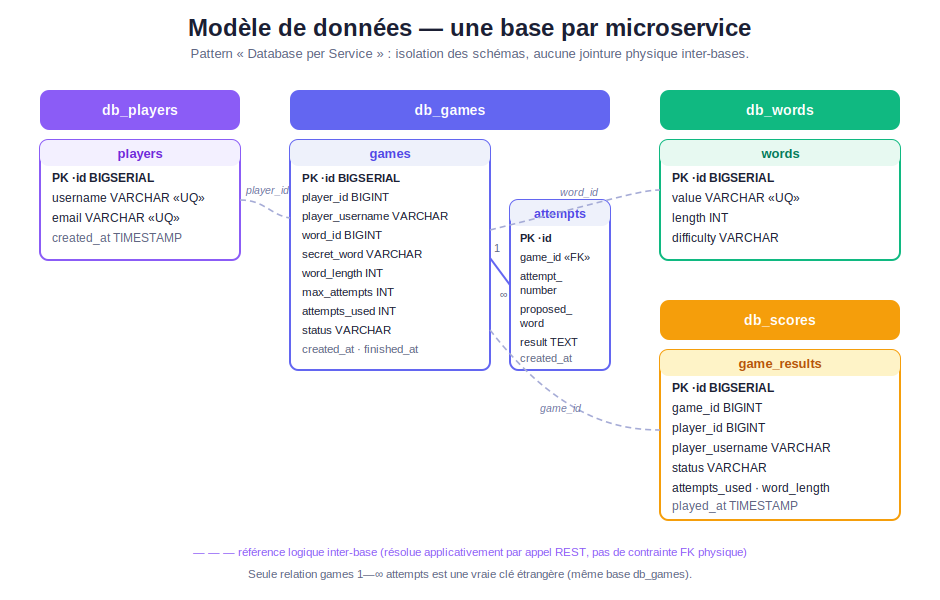
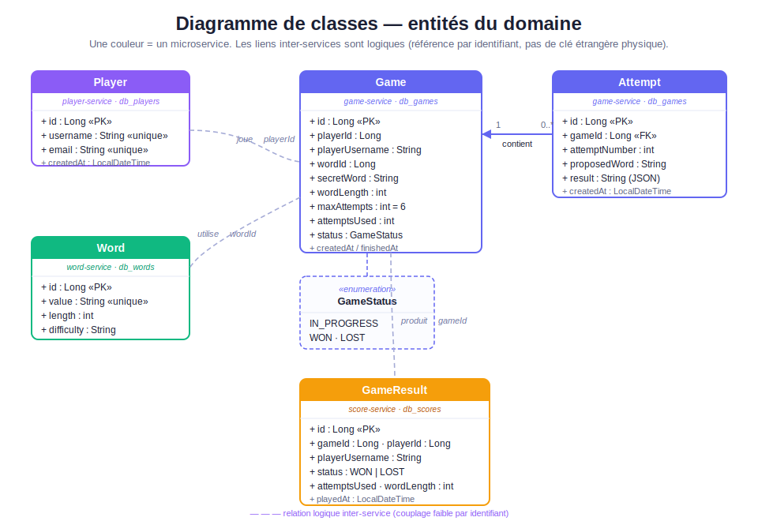
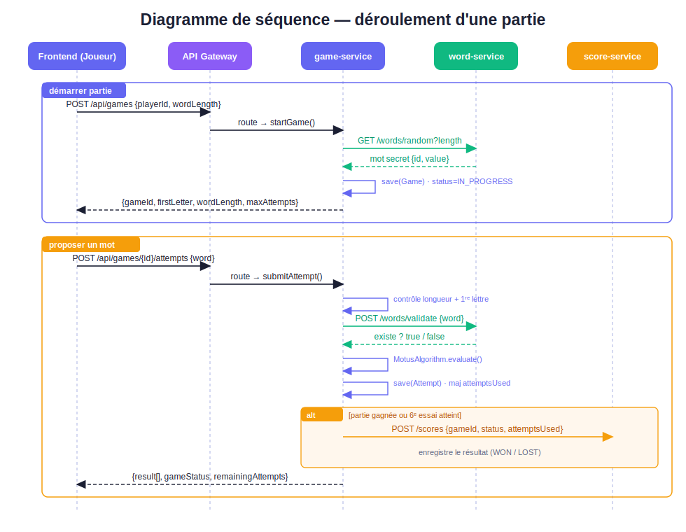
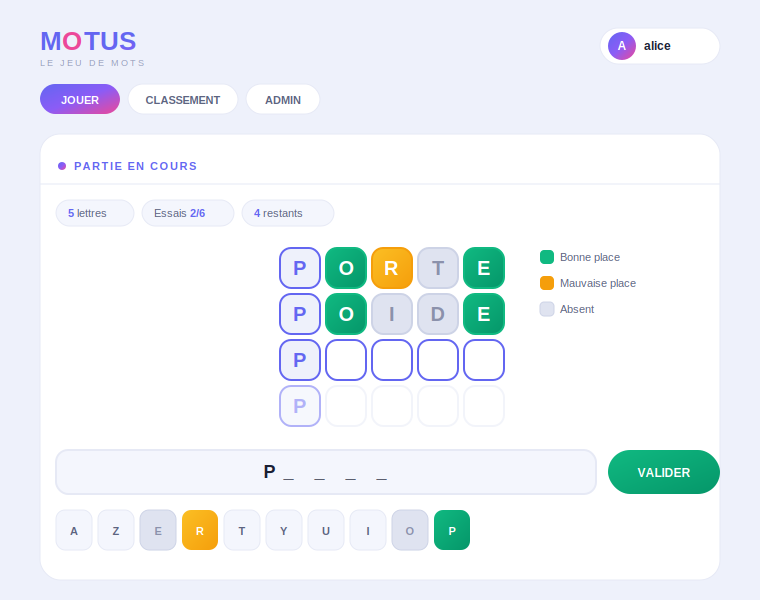

# MOTUS — Application Microservices Spring Boot

Implémentation complète du jeu **Motus** (variante française de Wordle) en architecture microservices Java Spring Boot, avec frontend vanilla HTML/CSS/JS et déploiement Docker/Kubernetes.

---

## Architecture

```
motus-app/
├── api-gateway/          → Spring Cloud Gateway (port 8080) — point d'entrée unique
├── player-service/       → Gestion des joueurs (port 8081, db: db_players)
├── game-service/         → Logique de jeu — moteur Motus (port 8082, db: db_games)
├── word-service/         → Dictionnaire de mots (port 8083, db: db_words)
├── score-service/        → Scores & classement (port 8084, db: db_scores)
├── admin-service/        → Panneau d'administration (port 8085, sans BDD)
├── frontend/             → SPA HTML/CSS/JS (Nginx port 3000)
├── k8s/                  → Manifestes Kubernetes
├── docker-compose.yml
├── init-db.sql
└── README.md
```

### Interactions entre services

```
Browser
  └─► API Gateway :8080
        ├─► player-service :8081  ──► score-service :8084
        ├─► game-service   :8082  ──► word-service  :8083
        │                          └─► score-service :8084
        ├─► word-service   :8083
        ├─► score-service  :8084
        └─► admin-service  :8085  ──► player/game/score services
```

> La passerelle écoute sur le port **8080** dans le réseau Docker, mais elle est exposée sur le port **8090** côté hôte (`8090:8080`). Toutes les URL `http://localhost:...` ci-dessous utilisent donc le port **8090**.

---

## Documentation & diagrammes

La documentation complète du projet se trouve dans le dossier [`docs/`](docs/) :

- 📄 **[Rapport de projet (.docx)](docs/Rapport-Motus-Microservices.docx)** — dossier complet (contexte, architecture, modèle de données, algorithme, sécurité, tests, déploiement).
- 🖼️ **Diagrammes UML** (sources SVG + PNG) dans [`docs/diagrams/`](docs/diagrams/).

### Architecture microservices



### Cas d'utilisation



### Modèle de données (une base par service)



### Diagramme de classes



### Séquence — déroulement d'une partie



> Pour régénérer les PNG à partir des SVG : `node .tooling/render.js` (nécessite `@resvg/resvg-js`).

---

## Stack technique

| Composant       | Technologie                          |
|----------------|--------------------------------------|
| Backend        | Java 21, Spring Boot 3.2.0           |
| ORM            | Spring Data JPA / Hibernate          |
| Base de données| PostgreSQL 15                        |
| Gateway        | Spring Cloud Gateway 2023.0.0        |
| Frontend       | HTML5, CSS3, JavaScript vanilla      |
| Serveur web    | Nginx (Alpine)                       |
| Conteneurs     | Docker, Docker Compose               |
| Orchestration  | Kubernetes                           |

---

## Lancement rapide (Docker Compose)

### Prérequis
- Docker >= 24.x
- Docker Compose >= 2.x
- (Optionnel) Maven 3.9+ et Java 21 pour build local

### Démarrage

```bash
cd /Users/abdrahamanecamara/motus-app
docker-compose up --build
```

Les services démarrent dans l'ordre (postgres → word/player/score → game → admin → gateway).

| Service         | URL                              |
|----------------|-----------------------------------|
| Frontend        | http://localhost:3000             |
| API Gateway     | http://localhost:8090             |
| Player Service  | http://localhost:8081             |
| Game Service    | http://localhost:8082             |
| Word Service    | http://localhost:8083             |
| Score Service   | http://localhost:8084             |
| Admin Service   | http://localhost:8085             |

### Arrêt et nettoyage

```bash
docker-compose down -v    # supprime aussi les volumes
```

---

## Build & tests (sans Docker)

Chaque service se compile indépendamment :

```bash
# Exemple pour game-service
cd game-service
mvn clean package

# Lancer les tests (game-service inclut des tests unitaires et d'intégration)
mvn test
```

Le **game-service** contient deux classes de test :
- `MotusAlgorithmTest` — tests unitaires de l'algorithme CORRECT/MISPLACED/ABSENT
- `GameServiceIntegrationTest` — tests d'intégration avec H2 in-memory et mocks Mockito

---

## API REST — Référence rapide

### Player Service (`/api/players`)

| Méthode | Endpoint                  | Description                        |
|---------|---------------------------|------------------------------------|
| POST    | `/register`               | Créer un joueur                    |
| GET     | `/`                       | Lister tous les joueurs            |
| GET     | `/{id}`                   | Obtenir un joueur                  |
| PUT     | `/{id}`                   | Modifier un joueur                 |
| DELETE  | `/{id}`                   | Supprimer un joueur                |
| GET     | `/{id}/stats`             | Statistiques d'un joueur           |

**Exemple — Inscription :**
```bash
curl -X POST http://localhost:8090/api/players/register \
  -H "Content-Type: application/json" \
  -d '{"username": "Alice", "email": "alice@example.com"}'
```

---

### Game Service (`/api/games`)

| Méthode | Endpoint                  | Description                        |
|---------|---------------------------|------------------------------------|
| POST    | `/`                       | Démarrer une partie                |
| GET     | `/{id}`                   | État d'une partie                  |
| GET     | `/player/{playerId}`      | Parties d'un joueur                |
| GET     | `/all`                    | Toutes les parties                 |
| POST    | `/{id}/attempts`          | Soumettre un mot                   |
| GET     | `/{id}/attempts`          | Historique des tentatives          |

**Exemple — Démarrer une partie :**
```bash
curl -X POST http://localhost:8090/api/games \
  -H "Content-Type: application/json" \
  -d '{"playerId": 1, "wordLength": 5}'
```

**Exemple — Soumettre un mot :**
```bash
curl -X POST http://localhost:8090/api/games/1/attempts \
  -H "Content-Type: application/json" \
  -d '{"word": "MOTUS"}'
```

Réponse :
```json
{
  "attemptNumber": 1,
  "proposedWord": "MOTUS",
  "result": [
    {"letter": "M", "position": 0, "status": "CORRECT"},
    {"letter": "O", "position": 1, "status": "CORRECT"},
    {"letter": "T", "position": 2, "status": "CORRECT"},
    {"letter": "U", "position": 3, "status": "CORRECT"},
    {"letter": "S", "position": 4, "status": "CORRECT"}
  ],
  "gameStatus": "WON",
  "secretWord": "MOTUS",
  "remainingAttempts": 5
}
```

---

### Word Service (`/api/words`)

| Méthode | Endpoint           | Description                             |
|---------|--------------------|------------------------------------------|
| GET     | `/random`          | Mot aléatoire (`?length=5`)             |
| GET     | `/{id}`            | Mot par ID                              |
| GET     | `/`                | Tous les mots                           |
| POST    | `/`                | Ajouter un mot                          |
| DELETE  | `/{id}`            | Supprimer un mot                        |
| POST    | `/validate`        | Valider un mot (`{"word": "MOTUS"}`)    |

---

### Score Service (`/api/scores`)

| Méthode | Endpoint                          | Description                |
|---------|-----------------------------------|----------------------------|
| POST    | `/`                               | Enregistrer un résultat    |
| GET     | `/player/{playerId}`              | Résultats d'un joueur      |
| GET     | `/player/{playerId}/stats`        | Statistiques d'un joueur   |
| GET     | `/leaderboard`                    | Top 10 classement          |
| GET     | `/`                               | Tous les résultats         |

---

### Admin Service (`/api/admin`)

Toutes les routes nécessitent le header `X-Admin-Key: admin-secret`.

| Méthode | Endpoint      | Description                    |
|---------|---------------|--------------------------------|
| GET     | `/games`      | Toutes les parties             |
| GET     | `/players`    | Tous les joueurs               |
| GET     | `/stats`      | Statistiques globales          |

```bash
curl http://localhost:8090/api/admin/stats \
  -H "X-Admin-Key: admin-secret"
```

---

## Algorithme Motus

L'algorithme de coloration `MotusAlgorithm.evaluate()` implémente la logique standard en deux passes :

1. **Passe 1 — CORRECT** : lettre à la bonne position → vert
2. **Passe 2 — MISPLACED** : lettre présente dans le mot mais à la mauvaise position → jaune
3. **ABSENT** : lettre absente → gris

Les lettres en double sont gérées correctement : une lettre n'est marquée MISPLACED que si elle apparaît dans le mot secret plus de fois qu'elle n'est déjà CORRECT.

---

## Déploiement Kubernetes

```bash
# Appliquer tous les manifestes dans l'ordre
kubectl apply -f k8s/postgres-deployment.yaml
kubectl apply -f k8s/word-service-deployment.yaml
kubectl apply -f k8s/player-service-deployment.yaml
kubectl apply -f k8s/score-service-deployment.yaml
kubectl apply -f k8s/game-service-deployment.yaml
kubectl apply -f k8s/admin-service-deployment.yaml
kubectl apply -f k8s/api-gateway-deployment.yaml

# Vérifier les pods
kubectl get pods
kubectl get services

# Accéder à l'API via NodePort
# http://<node-ip>:30080
```

Pour les images Docker, construire et taguer d'abord :
```bash
docker build -t motus/word-service:latest   word-service/
docker build -t motus/player-service:latest player-service/
docker build -t motus/score-service:latest  score-service/
docker build -t motus/game-service:latest   game-service/
docker build -t motus/admin-service:latest  admin-service/
docker build -t motus/api-gateway:latest    api-gateway/
```

---

## Frontend

L'interface est une SPA (Single Page Application) en HTML/CSS/JS pur, sans dépendance externe.



**Fonctionnalités :**
- Inscription / connexion par pseudo
- Sélection de la longueur du mot (5, 6 ou 7 lettres)
- Grille de jeu (6 lignes × N colonnes) avec couleurs en temps réel
- Clavier virtuel avec état des lettres déjà jouées
- Effets d'animation (retournement 3D, rebond, confettis)
- Classement des meilleurs joueurs
- Panneau admin (avec clé secrète)

**Thème graphique :** design clair, moderne et dynamique — fond en dégradés animés, couleur signature indigo–violet–rose, cartes arrondies et micro-interactions. Police *Space Grotesk* (titres) et *Inter* (corps).

---

## Variables d'environnement

| Variable           | Défaut              | Service(s)              |
|--------------------|---------------------|--------------------------|
| `DB_HOST`          | `localhost`         | player, word, game, score|
| `DB_NAME`          | service-specific    | player, word, game, score|
| `DB_USER`          | `motus`             | player, word, game, score|
| `DB_PASS`          | `motus`             | player, word, game, score|
| `WORD_SERVICE_URL` | `http://localhost:8083` | game                |
| `SCORE_SERVICE_URL`| `http://localhost:8084` | game, player        |
| `GAME_SERVICE_URL` | `http://localhost:8082` | admin               |
| `PLAYER_SERVICE_URL`| `http://localhost:8081`| admin               |
| `ADMIN_KEY`        | `admin-secret`      | admin                    |

---

## Auteur

Projet réalisé dans le cadre du cours de Microservices — MIAGE Paris-Dauphine.
